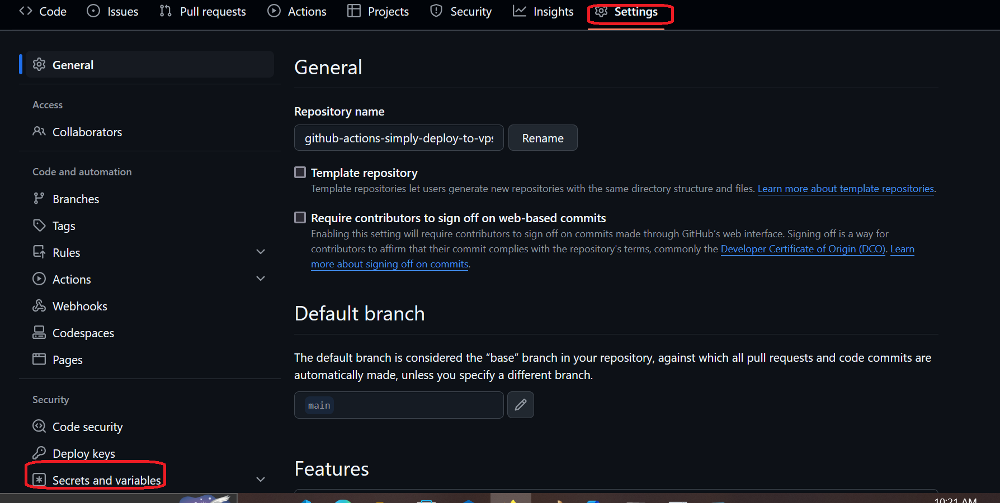
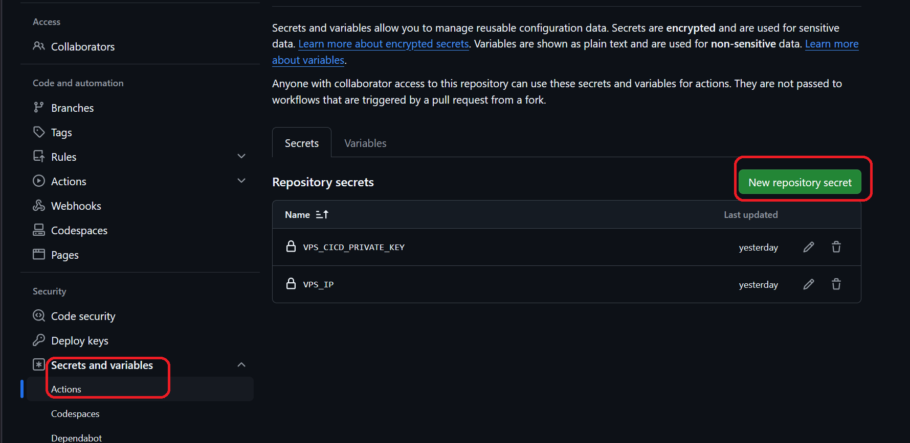
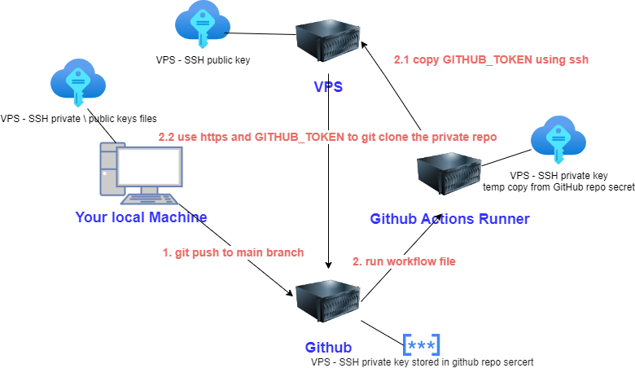
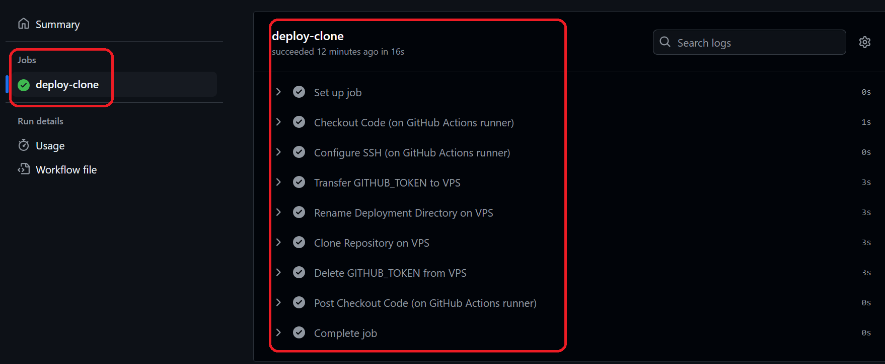
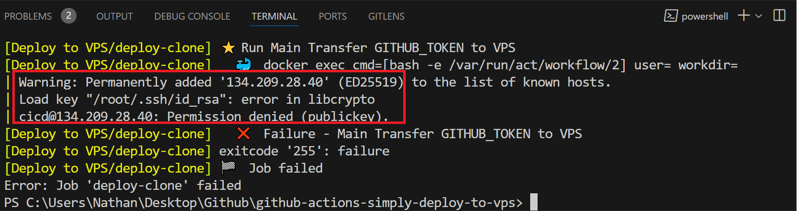

<h1>Project Name</h1>
Basic VPS deploy workflow using Github Actions


<h2>Project Description</h2>
<p>GitHub Actions workflow that clones a private repo to a VPS deploy folder. The previous deploy folder is renamed.</p>


<h2>Motivation</h2>
You have a private repo on Github and you want to deploy it to VPS upon git push to main branch using a workflow file

<h2>Installation</h2>

<h3>Workflow file</h3>
Copy the workfile file <code>clone-repo-on-vps.yml</code> to your repository root under <code>.github/workflows</code> and tweak it to fit your project needs ,  for example edit VPS_IP

<h3>Setup <code>VPS_CICD_PRIVATE_KEY</code> (once)</h3>

<p>Navigate to your GitHub repository settings and scroll down to the 'Secrets and variables' section on the dashboard as shown in the image:</p>


<p>Click on <code>Actions</code> under 'Secrets and variables' and then click on 'New repository secret'. Enter the private key of the VPS <code>cicd</code> user as shown in the following image:</p>


<h2>Technologies Used</h2>
<ul>
  <li>SSH</li>
  <li>Public / Private Key Authentication (VPS)</li>
  <li>GitHub Actions: Workflow, Secrets, and <code>GITHUB_TOKEN</code></li>
  <li>act (not a success here)</li>
  <li>Digital Ocean Droplet</li>
</ul>


<h2>Usage</h2>
Push to main branch


<h2>High-Level Design</h2>
<p>There are four components:</p>
<ul>
  <li>Your local machine - Issues commands from here, e.g., <code>git push</code> to the main branch.</li>
  <li>GitHub - Your private repository to be deployed on the VPS is hosted here.</li>
  <li>GitHub Actions Runner - This executes the workflow file.</li>
  <li>VPS - Your private repository is deployed here on a Digital Ocean droplet.</li>
</ul>

<p>These four components and the flow between them are described in this image:</p>



<h2>Design</h2>
<p>Following are questions that I asked myself when starting this repo. After the repo is finished, I have also provided the answers as listed here:</p>


<h3>Design Question: The repo is private, so how to access it?</h3>
<p>Using GitHub Actions, the best solution is to use <code>GITHUB_TOKEN</code>.</p>

<h3>Design Question: How does the VPS get the private repo?</h3>
<ol>
  <li>The VPS clones the repo. The <code>runner</code> needs to copy <code>GITHUB_TOKEN</code> to the VPS.</li>
  <li>Once the VPS has <code>GITHUB_TOKEN</code>, it can use <code>git clone</code> on the private repo.</li>
</ol>
<p>Comment: You don't need <code>GITHUB_TOKEN</code> if the repo is public.</p>

<h3>Design Question: Where to store the VPS SSH private key so the <code>runner</code> can access it?</h3>
<p>The best solution to store secrets in GitHub is to use GitHub Secrets, which is part of the repository. And this is what I will use.</p>


<h2>Code Structure</h2>
The code of the workflow file <code>clone-repo-on-vps.yml</code> is shown as follows

<h3>Setup</h3>

```bash
name: Deploy to VPS

on:
  push:
    branches:
      - main

jobs:
  deploy-clone:
    runs-on: ubuntu-latest

    env:
      USER: cicd
      VPS_IP: ${{ secrets.VPS_IP }}
      GITHUB_TOKEN_FILE: ~/github_token
      DEPLOYMENT_DIR: ~/deployments/app
```

<h3>Step 1</h3>

```bash
      - name: Checkout Code (on GitHub Actions runner)
        uses: actions/checkout@v3
        with:
          token: ${{ secrets.GITHUB_TOKEN }}
```

<h3>Step 2</h3>

```bash
      - name: Configure SSH (on GitHub Actions runner)
        run: |
          mkdir -p ~/.ssh
          echo "${{ secrets.VPS_CICD_PRIVATE_KEY }}" > ~/.ssh/id_rsa
          chmod 600 ~/.ssh/id_rsa
          echo "StrictHostKeyChecking no" > ~/.ssh/config
```

<h3>Step 3</h3>

```bash
      - name: Transfer GITHUB_TOKEN to VPS
        run: |
          ssh $USER@$VPS_IP "echo '${{ secrets.GITHUB_TOKEN }}' > $GITHUB_TOKEN_FILE"
```

<h3>Step 4</h3>

```bash
      - name: Rename Deployment Directory on VPS
        run: |
          ssh $USER@$VPS_IP "
            if [ -d $DEPLOYMENT_DIR ]; then
              mv $DEPLOYMENT_DIR ${DEPLOYMENT_DIR}_$(date +'%Y%m%d%H%M%S');
            fi
          "
```

<h3>Step 5</h3>

```bash
      - name: Clone Repository on VPS
        run: |
          ssh $USER@$VPS_IP "
            export GITHUB_TOKEN=$(cat $GITHUB_TOKEN_FILE)
            git clone https://${{ github.repository_owner }}:${{ secrets.GITHUB_TOKEN }}@github.com/${{ github.repository }} $DEPLOYMENT_DIR
          "
```

<h3>Step 6</h3>

```yml
      - name: Delete GITHUB_TOKEN from VPS
        run: |
          ssh $USER@$VPS_IP "rm $GITHUB_TOKEN_FILE"
```

<h2>Demo</h2>
<p>After pushing to the main branch, you can check the status on the GitHub dashboard as shown in the following image:</p>



<h2>Points of Interest</h2>
<ul>
  <li>
    <strong>VPS IP in GitHub Actions Secrets</strong><br>
    Used like so to ensure it won't be exposed to the public, yet works for the repo owner.
  </li>

  <li>
    <strong>Invoke Parts of Workflow Using <code>act</code></strong><br>
    I am able to invoke a specific job:
    <pre><code>act -j deploy-clone</code></pre>
  </li>
</ul>

<h2>Possible Improvements</h2>
<ul>
  <li>
    <strong>Eliminate Copy <code>GITHUB_TOKEN</code> to VPS</strong><br>
    There is some security risk here because the token is exposed on the VPS, although it is removed after the job is ended. You might eliminate this by using <code>scp</code> and simply copying the repo from the <code>runner</code> to the VPS directly.
  </li>
  <li>
    <strong>Add Specific Project Stuff to Workflow</strong><br>
    You might have packages you need to install, stop the app before deployment, restart it after deployment, and similar tasks. You can add all of this as bash code to the workflow file or create a script and call it from the workflow.
  </li>
</ul>


<h2>Open Issues</h2>
<ul>
  <li>
    <code>id_rsa</code> is used in <code>clone-repo-on-vps.yml</code> as a generic private key name even though the key is not RSA. Otherwise, I started getting issues. This may be related to default settings or <code>~</code> on the VPS versus the <code>runner</code>.
  </li>

  <li>
    act did not finish the workflow <code>clone-repo-on-vps.yml</code> as shown in the following image:
    <br>
    
  </li>

  <li>
    I am not able to invoke a specific workflow. It starts but hangs:
    <pre><code>act -w .\.github\workflows\clone-repo-on-vps.yml</code></pre>
  </li>
</ul>

<h2>References</h2>
<ul>
    <li><a href="https://www.youtube.com/watch?v=R48-UaZ4q1k">SSH Essentials in 7.5 minutes</a></li>
    <li><a href="https://youtu.be/x239z6DdE0A?si=Di81DK0RrphVxkmZ">Introduction to GitHub Actions: Learn Workflows with Examples</a></li>
    <li><a href="https://youtu.be/Mir-uLSQmwA?si=IYPgxQBjJOLtvGod">Efficiently Run GitHub Actions Workflows Locally with act Tool</a></li>
</ul>
