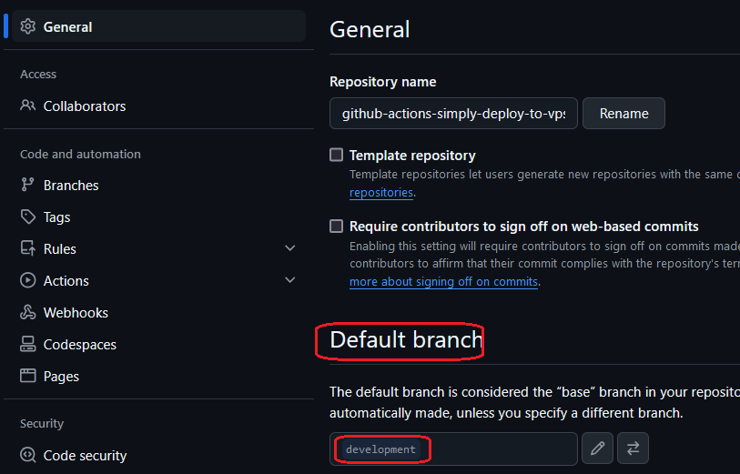

<h1>Project Name</h1>
....

<h2>Project Description</h2>
....

<h2>Motivation</h2>
You have a private repo on Github and you want to deploy it to VPS upon git post to main branch using a workflow file

<h2>Installation</h2>

<h3>Github</h3>
1. i want push to be by default to development branch so will not invoke github action on the server , instead use act. only push to main will invoke Github Action on Github
2. need to change on Github repo dashboard :
- click on branch
- click on 'New Branch' and enter a name 'development'
 
The result appear in the following image

change the default branch from the repo dseeting as shown in the following image

After few more clicks we will get the development branch as default branch as shown in the following image

<h2>Usage</h2>
....

<h2>Technologies Used</h2>
<ul>
<li>SSH</li>
 <li>public \ private key authentication (VPS)</li>
<li>Github Actions</li>
<li>act</li>
</ul>

<h2>High level design</h2>
There are four components
<ul>
<li>your local machine - issue from here e.g. git push to main branch</li>
<li>Github - your private repo to be deployed on VPS is here</li>
<li>Github Actions Runner - this run the workflow file</li>
<li>VPS - here the private repo is deployed</li>

</ul>
todo nath ---> make this an image

<h2>Design</h2>

Following are questions that i have asked myself when starting this repo. After the repo is finish i have also the answewrs as listed here

<h3>Design question : should i use ssh agent</h3>
i see no benefit in my use case but need to re-check

<h3>Design question : the repo is privte so how to access it</h3>
Using github actions the best solution is to use GITHUB_TOKEN . 

<h3>Design question : how the vps get the repo</h3>

<ol>
<li>clone by the vps . runner need to copy GITHUB_TOKEN to the vps</li>
<li>trnasfer from the runner to the vps using ssh .runner use GITHUB_TOKEN and scp to copy the repo to the vps</li>
</ol>

?????????? open issue which one to choose ???????????

<h3>Design question : where to store VPS SSH private key so the runner can access it </h3>
The best solution to store screts in github is to use Github secrets which is part of the repo. And this is what i will use

<h2>Code Structure</h2>
....

<h2>Demo</h2>
....

<h2>Points of Interest</h2>
<ul>
    <li>...</li>
   
</ul>

<h2>References</h2>
<ul>
    <li><a href='https://www.youtube.com/watch?v=R48-UaZ4q1k'>SSH Essentials in 7.5 minutes </a></li>
    <li><a href='https://youtu.be/x239z6DdE0A?si=Di81DK0RrphVxkmZ'>Introduction to GitHub Actions: Learn Workflows with Examples</a></li>
    <li><a href='https://youtu.be/Mir-uLSQmwA?si=IYPgxQBjJOLtvGod'>Efficiently Run GitHub Actions Workflows Locally with act Tool </a></li>
    
</ul>

